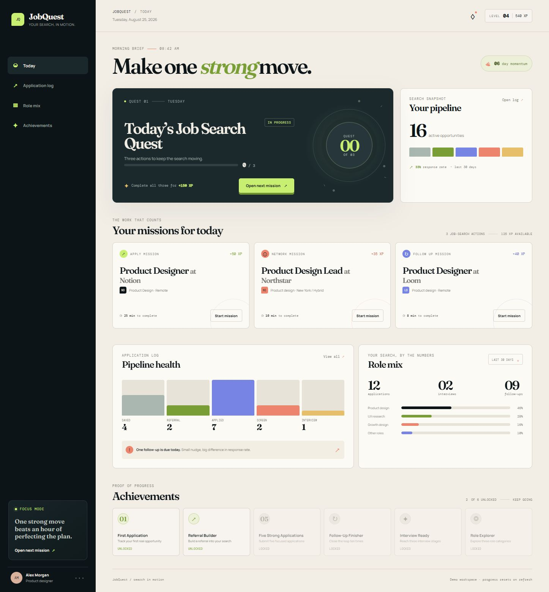

# JobQuest

**A job-search accountability dashboard that turns applications, networking, and follow-ups into focused missions.**



JobQuest is a responsive front-end prototype for people who want the job search to feel more visible, motivating, and manageable. It helps a job seeker track real opportunities, decide on the next action, and build momentum without becoming another generic task app.

> JobQuest is an execution and accountability layer around the job search. It does not search for jobs or submit applications on the user’s behalf.

## What is working

- A daily job-search quest with Apply, Network, and Follow up missions.
- First-run experience with an empty application log and one clear starting action.
- Optional demo data for walkthroughs and visual review.
- Job tracking by pasted job-post URL, title, company, role category, location, and source.
- Preset role categories plus custom categories that are saved for reuse.
- Next action, due date, and notes for each tracked opportunity.
- Application Log search, pipeline-stage filtering, stage updates, detail editing, and job-post links.
- Due today view for opportunities with a next action scheduled for the current date.
- Role mix, application, interview, follow-up, pipeline, XP, streak, and achievement feedback.
- Responsive layout for desktop and narrow screens.
- Browser-local persistence through `localStorage`.

## Run it locally

The prototype has no build step and no dependency install is required.

```powershell
python -m http.server 4173
```

Then open [http://localhost:4173](http://localhost:4173).

If Python is not available, serve the repository root with any static HTTP server. Opening `index.html` directly may work in some browsers, but an HTTP server is the reliable option.

## Try the main flow

1. Open the app with a fresh browser origin.
2. Select **Track a job**.
3. Paste a real job-post URL and add the role details.
4. Choose a preset role category, or select **Add custom category…** to create one that will be available again later.
5. Add a next action, due date, and notes if useful.
6. Start the mission. JobQuest adds the opportunity to the log and creates related networking and follow-up missions.
7. Use **Application log** to search, filter, change pipeline stage, edit details, or open the saved post.
8. Use **Due today**, **Role mix**, and **Achievements** to review the search without losing the next action.

For a guided walkthrough, select **Load demo data** in the footer. Select **Start fresh** to return to the empty first-run state.

## Development checks

From the repository root:

```powershell
npm run lint
```

The lint script runs Node’s syntax check against `app.js`. There is currently no TypeScript build, test suite, backend, or external API integration.

## Data and privacy boundary

Tracked jobs are stored only in the current browser under the `jobquest-state-v2` localStorage key. There is no account system, cloud sync, server database, URL scraping, or third-party API call in this prototype. Use fictional or non-sensitive data when sharing a demo browser profile.

The demo records use example URLs and fictional sample opportunities. They are included to make the interface easy to review and are not live job listings.

## Project structure

```text
.
├── README.md                      # Project overview and setup
├── DESIGN.md                      # Product, UX, visual, and validation decisions
├── index.html                     # App shell and accessible markup
├── styles.css                     # Visual system and responsive layout
├── app.js                         # State, rendering, persistence, and interactions
├── package.json                   # Minimal local validation script
├── package-lock.json              # Reproducible npm audit metadata
└── jobquest-full-page.png         # Current visual reference
```

## Product direction

The core promise is: **make the job search easier to do, not just easier to organize.** The visual language is sleek editorial utility—graphite structure, cool porcelain surfaces, aqua progress signals, coral follow-up cues, and crisp typographic hierarchy.

The next product-level step is validating the flow with real job seekers. The next technical step after that would be authenticated cloud persistence, followed by reminders and optional job-post metadata extraction.

More detailed product decisions and the current validation checklist live in [`DESIGN.md`](DESIGN.md).
